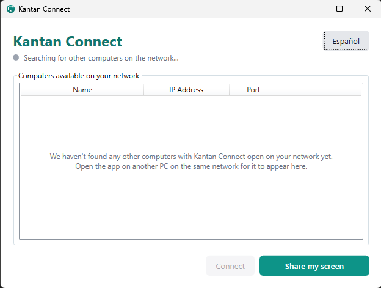
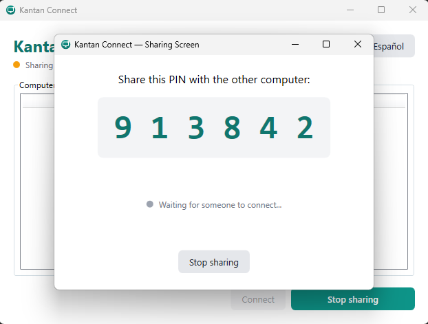
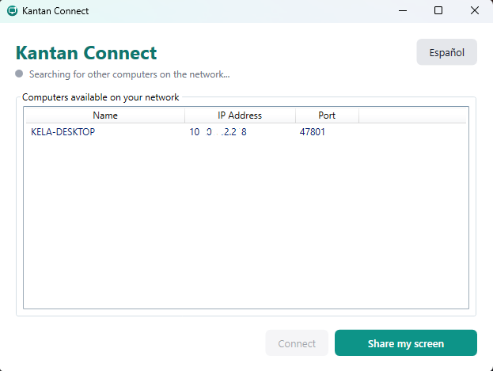

# Kantan Connect (簡単コネクト)

**Zero-configuration LAN screen sharing and remote control for Windows**, built in C#/.NET 10.

Think "TeamViewer, but homemade and LAN-only" — the kind of thing you'd set up so you can
help a family member on the same home network without walking them through an IP address
over the phone.

Open the app on two PCs on the same home network and, without typing a single IP address,
one can see and control the other's screen — automatic peer discovery, PIN-based pairing,
GPU-accelerated screen capture, and native mouse/keyboard injection.

> This project intentionally trades internet-grade security for zero-friction LAN use.
> See [Design Decisions](#design-decisions) below for why. **Not intended for untrusted
> networks or production use.**

> Built with AI assistance; architecture and design decisions are my own.


---

## Features

- **Zero-config discovery** — UDP broadcast finds other Kantan Connect instances on the LAN automatically. No IP addresses, no manual setup.
- **PIN pairing** — a 4–6 digit PIN (max 3 attempts) is the only barrier between "share" and "connect."
- **GPU screen capture** — DXGI Desktop Duplication for near-zero-cost capture, with an automatic GDI fallback for RDP sessions, unsupported GPUs, or locked screens.
- **Real remote control** — mouse and keyboard events are replayed on the Host via the native `SendInput` Win32 API.
- **Self-elevating & self-configuring** — the app requests Administrator on launch and creates its own Windows Firewall rules, so the user never has to touch either.
- **Bilingual UI** — a language toggle switches every visible string between English and neutral Spanish live, no restart.
- **Portable core** — the protocol, discovery, and session logic have zero Windows dependencies, in preparation for an Android port.

## Screenshots

| Main window | PIN pairing | Peer discovered |
|---|---|---|
|  |  |  |

## Getting Started

### Requirements

- Windows 10/11 (x64)
- [.NET 10 SDK](https://dotnet.microsoft.com/download) to build from source

### Build & run

```powershell
git clone https://github.com/Kelastian/kantan-connect.git
cd kantan-connect
dotnet build
dotnet run --project src/KantanConnect.App
```

The app must run as Administrator — it will prompt for elevation automatically (UAC) on
first launch, and will create its own Windows Firewall rules for you.

### Run the tests

```powershell
dotnet test tests/KantanConnect.Core.Tests
```

29 tests cover the protocol framing, PIN generation, UDP discovery, and TCP session
negotiation — all against real sockets on loopback, not mocks (see
[Design Decisions](#design-decisions)).

### Using it

1. Open `KantanConnect.exe` on two PCs on the same LAN.
2. On PC A: click **Share my screen** — a PIN appears.
3. On PC B: the PC A entry appears automatically in the peer list — select it and click
   **Connect**.
4. Enter the PIN shown on PC A. Once accepted, PC B sees PC A's screen live and can
   control its mouse and keyboard.

---

## Architecture

The solution is split into four projects, deliberately layered so that **`Core` has zero
Windows dependencies** — the protocol, discovery, and session logic are portable, in
preparation for a future Android client sharing the same wire protocol.

```
KantanConnect.sln
├─ src/
│  ├─ KantanConnect.Core        (net10.0)          ← portable, no UI, no Windows APIs
│  │   ├─ Models/               PeerInfo, ScreenInfo, CapturedFrame, InputEvent
│  │   ├─ Discovery/            UDP broadcast beacon + listener
│  │   ├─ Protocol/             Length-prefixed TCP framing + message types
│  │   ├─ Security/             PIN generation
│  │   ├─ Session/              HostSession / ViewerSession (the protocol state machine)
│  │   └─ Abstractions/         IScreenCapturer, IInputInjector, IFrameEncoder
│  │
│  ├─ KantanConnect.Windows     (net10.0-windows)  ← the only project touching Win32
│  │   ├─ Capture/              DXGI Desktop Duplication + GDI fallback
│  │   ├─ Encoding/             JPEG frame encoding
│  │   ├─ Input/                SendInput P/Invoke wrapper
│  │   ├─ Interop/              Native struct/DllImport declarations
│  │   └─ Platform/             Admin elevation + Firewall rule automation
│  │
│  └─ KantanConnect.App         (net10.0-windows, WPF)  ← UI + composition root
│      ├─ Views (*.xaml)        MainWindow, HostWindow, ViewerWindow, PinPromptWindow
│      ├─ ViewModels/           MVVM, no WPF types leak into Core
│      ├─ Services/             LocalizationService (live ES/EN switching)
│      └─ Converters/           Status → color bindings
│
└─ tests/
   └─ KantanConnect.Core.Tests  (xUnit)  ← protocol, PIN, discovery, session — real sockets
```

### Session flow

```
HOST                                          VIEWER
1. Click "Share my screen"
2. Generates a PIN, shows it large
3. Starts UDP-broadcasting "I'm here"  →      4. Sees the Host in its peer list
                                               5. Click Connect → opens a TCP connection
6. Accepts TCP, requests the PIN        →     7. UI asks the user for the PIN → sends it
8. Verifies PIN (max 3 attempts)
9. OK → captures the screen (DXGI) and  →     10. Receives JPEG frames, draws them live
   streams frames continuously                11. Moves the mouse / types over the image
12. Receives input events               ←        → sends normalized (0..1) coordinates + keys
13. Replays them with SendInput
```

## Tech stack

| Area | Choice |
|---|---|
| Runtime | .NET 10, WPF |
| Screen capture | DXGI Desktop Duplication (`Vortice.Windows`) + GDI fallback |
| Discovery | UDP Broadcast |
| Pairing | 4–6 digit PIN, `RandomNumberGenerator` |
| Input injection | `user32.dll` `SendInput` via P/Invoke |
| Transport | Raw TCP sockets, custom length-prefixed framing |
| Serialization | `System.Text.Json` |
| Tests | xUnit, real sockets on loopback |

## Roadmap

- [x] Windows ↔ Windows screen sharing and remote control
- [ ] Android client (the reason `Core` has no Windows dependencies)
- [ ] Multi-monitor support
- [ ] Other platforms

---

## Design Decisions

This section explains the *why* behind choices that weren't obvious from the code alone —
written for anyone reviewing this repo who wants to see the reasoning, not just the result.

**Security was traded for zero friction, on purpose.** There's no TLS, no strong
authentication — a 4–6 digit PIN is the only gate. That's a deliberate scope decision, not
an oversight: this app is built to run inside a single trusted home LAN, never over the
internet. Given that scope, the PIN's job isn't cryptographic security — it's *social
friction*: enough to stop an accidental connection, not enough to need a password manager.
The `.exe` runs elevated and configures its own Firewall rules specifically so the target
user (the "share my screen with grandma" use case) never sees a technical prompt they can't
answer.

**Why the app requires Administrator.** Two concrete APIs need it: `SendInput` (moving the
real mouse/keyboard across arbitrary windows, including ones running elevated, requires
matching privilege due to UIPI) and creating Windows Firewall rules via `netsh`. Without
elevation, either of those would fail with a confusing low-level error instead of the UAC
prompt Windows already knows how to show. The manifest declares `requireAdministrator` up
front so the failure mode is "Windows asks for permission" rather than "the app breaks
later, silently."

**Why `Core` has zero dependencies on anything Windows-specific.** The stated goal is
Windows-to-Windows now, Android later. Every file in `KantanConnect.Core` — the wire
protocol, PIN generation, discovery, the session state machine — only depends on the .NET
base class library. Anything that touches an actual OS API (`DXGI`, `user32.dll`, GDI) lives
in `KantanConnect.Windows`, reached only through interfaces (`IScreenCapturer`,
`IInputInjector`, `IFrameEncoder`) defined in `Core`. The day an Android client exists, it
implements those same three interfaces with Android APIs and reuses the entire protocol
and session layer unchanged.

**A real concurrency bug, caught by testing against real sockets instead of mocks.** Once
video streaming (frames from Host to Viewer) and the existing Ping/Pong heartbeat needed to
share the same TCP stream, two code paths could write to the same socket concurrently — TCP
supports simultaneous read/write, but not two concurrent writers, so their bytes could
interleave and corrupt the custom message framing. All I/O tests in this project use real
sockets on loopback rather than mocks specifically because this class of bug — timing- and
interleaving-dependent — is invisible to a mock of either side. The fix was a `SemaphoreSlim`
serializing every write; a stress test that fires 50 frames back-to-back without waiting
confirms all 50 arrive intact and in order.

**A DXGI bug that only manual capture-and-inspect testing would have caught.** The first
working version of the DXGI capturer passed a naive smoke test (grab a frame, save it) but
failed on the *second* capture with `DXGI_ERROR_INVALID_CALL`. Desktop Duplication requires
releasing each acquired frame before requesting the next one — the API doesn't buffer
requests, it errors. This is exactly the kind of state-machine bug that only shows up when
you actually exercise the sequence a real capture loop would use (capture, capture again),
not a single call.

**A WPF selection bug, and the general lesson it left.** The peer list initially rebuilt
each `PeerListItemViewModel` from scratch on every discovery beacon (roughly once a second).
That's harmless for the data itself, but WPF's `ListView` selection is tied to object
*identity* — recreating the item silently dropped the user's selection about a second after
they clicked it, making the "Connect" button flicker enabled/disabled with no apparent
cause. The fix was updating the existing view-model instance in place instead of
replace-on-every-update. The broader lesson carried into the rest of the codebase: any list
bound to a mutable, frequently-refreshed source needs to preserve object identity across
updates, or WPF's selection and animation state silently breaks.

**Native API signatures were verified against a live compile-and-run, not memory.** Both the
DXGI/Direct3D11 bindings (`Vortice.Windows`) and the raw `SendInput`/`INPUT`/`MOUSEINPUT`
P/Invoke declarations went through the same process: write the call based on documentation,
then actually compile and execute a small probe against the real API on this machine
(confirming exact struct sizes, field offsets, and that a real `SendInput` call moved the
cursor to the expected pixel) before wiring it into the real code. An earlier assumption
about a Vortice method signature turned out to be wrong on the first attempt — a cheap
mistake to make and an expensive one to ship silently, so verification became the standard
for every native API surface in this project rather than a one-off fix.

Bugs like the three above were found *during* manual, end-to-end verification against the
real running app — often across two physical PCs — not assumed away, which is why the fixes
and their root causes are documented here rather than just fixed and forgotten.

---

## Why I built this

I wanted to understand how remote desktop software works under the hood instead of treating it as a black box.

The goal: learn by building:

- Screen capture with Windows APIs
- Mouse and keyboard input injection
- TCP communication
- LAN device discovery
- Clean project architecture

The project is intentionally structured so that platform-independent logic lives in a reusable Core library, while Windows-specific code is isolated. This makes future ports (e.g. Android) much easier.

---

## 概要（日本語）

**Kantan Connect**（簡単コネクト）は、同じ家庭内LANに接続された2台のWindows PC間で、
IPアドレスを入力することなく画面を共有し、遠隔操作できるC#/.NET製アプリケーションです。

- **自動検出**：UDPブロードキャストで同じネットワーク上の他の端末を自動的に発見します。
- **PINによるペアリング**：4〜6桁のPINだけで接続を許可し、設定の手間を最小限にします。
- **GPUキャプチャ**：DXGI Desktop Duplicationによる高速な画面キャプチャ（GDIへの自動フォールバック付き）。
- **リアルな遠隔操作**：`SendInput` APIを使用して、マウスとキーボードの操作を実際にホスト側で再現します。

このプロジェクトは、インターネット経由の高度なセキュリティよりも、
信頼できる家庭内ネットワークでの「設定不要」な使いやすさを優先しています。
**信頼できないネットワークや本番環境での使用は想定していません。**

---

## License

[MIT](LICENSE)
